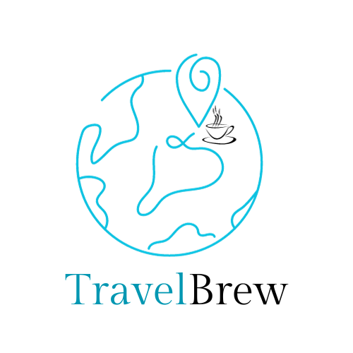
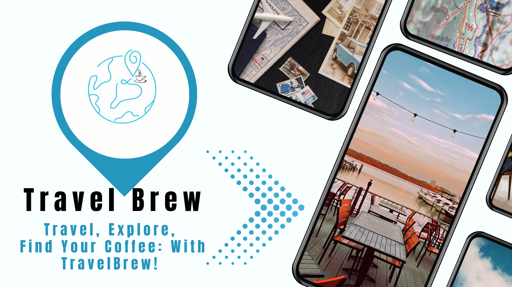
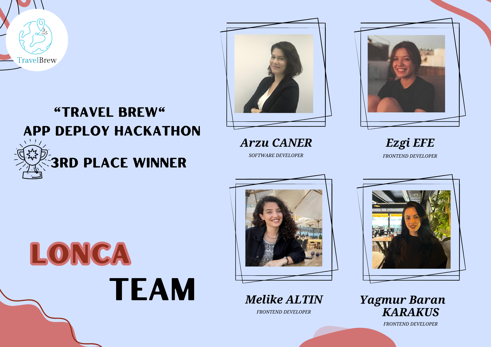

<h1 align="center"><b>TravelBrew ☕ </b></h1>
<a name="readme-top"></a>


<!-- PROJECT LOGO -->
<br />
<div align="center">
  <a href="https://github.com/arzucaner/travel-brew">
    
  </a>
  </div>
<div>
  <h2 align="center">TravelBrew</h2>

  <p align="center">
    Explore nearby gas stations, cafés, and restaurants with this awesome app! 
    <br />
    <br />
    <a href="https://github.com/arzucaner/travel-brew">View Code</a>
    ·
    <a href="https://github.com/arzucaner/travel-brew/issues">Report Bug</a>
    ·
    <a href="https://github.com/arzucaner/travel-brew/issues">Request Feature</a>
  </p>
</div>


<!-- TABLE OF CONTENTS -->
<details>
  <summary>Table of Contents</summary>
  <ol>
    <li>
        <a href="#about-the-project">About the Project</a>
      <ul>
        <li><a href="#what-is-travelbrew">What is TravelBrew ?</a></li>
      </ul>
       <ul>
        <li><a href="#built-with">Built With</a></li>
      </ul>
    </li>
    <li>
      <a href="#getting-started">Getting Started</a>
      <ul>
        <li><a href="#prerequisites">Prerequisites</a></li>
        <li><a href="#installation">Installation</a></li>
      </ul>
    </li>
    <li><a href="#usage">Usage</a></li>
    <li><a href="#roadmap">Roadmap</a></li>
    <li><a href="#contributing">Contributing</a></li>
    <li><a href="#project-team">Project Team</a></li>
    <li><a href="#license">License</a></li>
  </ol>
</details>


<!-- ABOUT THE PROJECT -->

## About the Project ✨

### ❔ What is TravelBrew?
<br/>
TravelBrew is a mobile application designed to assist travellers in discovering the best coffee and cosy spots in the places they visit. The app empowers users to explore top-notch venues that cater to their essential needs, such as coffee, sandwiches, seating areas, and restrooms, while they travel through different cities.
<br/>
<br/>
<div align="center">
    
  </a>
</div>
 </br>

Click for [Documentation](https://github.com/arzucaner/travel-brew\documantation.pdf)

### 🗝️ Key Features:

* Find cafes, gas stations and restaurants: Easily locate the cafes, gas stations and restaurants in the city you're travelling to.
* Filtering Options: Filter options based on your preferences (coffee, sandwich, seating area, restroom, gas stations etc.).
* User Reviews: Access reliable recommendations by browsing through reviews from fellow travellers and locals.
* Map Integration: View cafes on the map and quickly find the ones nearest to you.


### 💻 Built With


[![ReactNative][ReactNative.js]][ReactNative-url]  [![Expo][Expo]][Expo-url]  [![Firebase][Firebase]][Firebase-url]  [![npm][npm]][npm-url]


<p align="right"><a href="#readme-top">Back to the Top ↑ </a></p>


<!-- GETTING STARTED -->
## 🏁 Getting Started

This is an example of how you may give instructions on setting up your project locally.
To get a local copy up and running follow these simple example steps.

### Prerequisites

This is an example of how to list things you need to use the software and how to install them.
* npm
  ```sh
  npm install npm@latest -g
  ```

### 📥 Installation

_Below is an example of how you can instruct your audience on installing and setting up your app. This template doesn't rely on any external dependencies or services._

1. Get a free API Key at [developers.google.com](https://developers.google.com/maps/documentation/places/web-service?hl=tr)
2. Clone the repo
   ```sh
   git clone https://github.com/arzucaner/travel-brew
   ```
3. Install NPM packages
   ```sh
   npm install
   ```
4. Enter your API in `config.js`
   ``` js
   const API_KEY = 'ENTER YOUR API';
   ```

5. Start 
   ```sh
    npm expo start
   ```

<p align="right"><a href="#readme-top">Back to the Top ↑ </a></p>


<!-- USAGE EXAMPLES -->
##
### 📱 Usage

You can scan the QR code below to see how the project works.
<br/>
<br/>
<div align="center">
    
  </a>
</div>
 </br>

_For more, please click to the [link](https://expo.dev/@ezgiefe111/TravelBrew?serviceType=classic&distrubution=expo-go)_


<!-- ROADMAP -->
##
### 🗺️ Roadmap

- [ ] Create React Native App
- [ ] Add API
- [ ] Add Expo and npm
- [ ] Code the pages
- [ ] Run and test the project
- [ ] Make deployment and presentation
- [ ] Add and organize the readme


See the [open issues](https://github.com/arzucaner/travel-brew/issues) for a full list of proposed features (and known issues).

<p align="right"><a href="#readme-top">Back to the Top ↑ </a></p>


<!-- CONTRIBUTING -->
## 🤝 Contributing

Contributions are what makes the open-source community such an amazing place to learn, inspire, and create. Any contributions you make are **greatly appreciated**.

If you have a suggestion that would make this better, please fork the repo and create a pull request. You can also simply open an issue with the tag "enhancement".
Don't forget to give the project a star! Thanks again!

1. Fork the Project
2. Create your Feature Branch (`git checkout -b feature/AmazingFeature`)
3. Commit your Changes (`git commit -m 'Add some AmazingFeature'`)
4. Push to the Branch (`git push origin feature/AmazingFeature`)
5. Open a Pull Request


<!-- PROJECT-TEAM-->
## 👩‍💻 Project Team

* Arzu CANER - [GitHub](https://github.com/arzucaner) | [LinkedIn](https://www.linkedin.com/in/arzucaner/)
* Ezgi EFE -  [GitHub](https://github.com/eefe1) | [LinkedIn](https://www.linkedin.com/in/ezgi-efe-60721b220/)
* Melike ALTIN -[GitHub](https://github.com/melikealtin) | [LinkedIn](https://www.linkedin.com/in/melike-alt%C4%B1n-b69429227/)
* Yağmur Baran KARAKUŞ - [GitHub](https://github.com/yagmurbarank) |  [LinkedIn](https://www.linkedin.com/in/yagmurbarankarakus/) 

 <br />
<div align="center">
    
  </a>
</div>

<br/>

<p align="right"><a href="#readme-top">Back to the Top ↑ </a></p>

<!-- LICENSE -->
## 📜 License

Distributed under the MIT License. See `license` for more information.


<br/>


[![Contributors][contributors-shield]][contributors-url]
[![Forks][forks-shield]][forks-url]
[![Stargazers][stars-shield]][stars-url]
[![Issues][issues-shield]][issues-url]
[![MIT License][license-shield]][license-url]
[![LinkedIn][linkedin-shield]][linkedin-url]

<!-- MARKDOWN LINKS & IMAGES -->
<!-- https://www.markdownguide.org/basic-syntax/#reference-style-links -->
[contributors-shield]: https://img.shields.io/github/contributors/arzucaner/travel-brew.svg?style=for-the-badge
[contributors-url]: https://github.com/arzucaner/travel-brew/graphs/contributors
[forks-shield]: https://img.shields.io/github/forks/arzucaner/travel-brew.svg?style=for-the-badge
[forks-url]: https://github.com/arzucaner/travel-brew/members
[stars-shield]: https://img.shields.io/github/stars/arzucaner/travel-brew.svg?style=for-the-badge
[stars-url]: https://github.com/arzucaner/travel-brew/stargazers
[issues-shield]: https://img.shields.io/github/issues/arzucaner/travel-brew.svg?style=for-the-badge
[issues-url]: https://github.com/arzucaner/travel-brew/issues
[license-shield]: https://img.shields.io/github/license/arzucaner/travel-brew.svg?style=for-the-badge
[license-url]:https://github.com/arzucaner/travel-brew/blob/main/license/license
[linkedin-shield]: https://img.shields.io/badge/-LinkedIn-black.svg?style=for-the-badge&logo=linkedin&colorB=555
[linkedin-url]: https://linkedin.com/in/company/lonca-works/
[product-screenshot]: images/screenshot.png
[ReactNative.js]: https://img.shields.io/badge/react_native-%2320232a.svg?style=flat&logo=react&logoColor=%2361DAFB
[ReactNative-url]: https://reactnative.dev/
[Expo]:https://img.shields.io/badge/expo-1C1E24?style=flat&logo=expo&logoColor=#D04A37
[Expo-url]: https://expo.dev/
[Firebase]:https://img.shields.io/badge/Firebase-1A1C1E?style=flat&logo=Firebase&logoColor=#FFCB2F
[Firebase-url]:https://firebase.google.com/
[npm]:https://img.shields.io/badge/NPM-1A1C1E.svg?style=plastic&logo=npm&logoColor=#CB3837
[npm-url]:https://www.npmjs.com/
